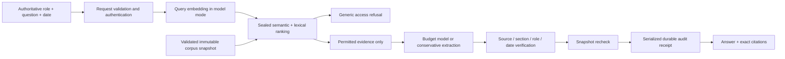

# Architecture

Policy Atlas is a single-process Node 22 service. The browser is a static, dependency-free client of the same HTTP service. The only npm dependency is the development browser-test runner. Corpus loading, lexical retrieval, citation checking, caching and audit persistence run locally on CPU.

## Corpus and time

`src/corpus.js` resolves every source path inside `CORPUS_DIR`, checks its SHA-256, validates roles and dates, rejects duplicate documents/passages, and verifies each passage against its named section. The manifest and passages are reread at the end to reject a concurrently replaced input set. The fingerprint binds manifest bytes, passage bytes and all source hashes. Lexical statistics are rebuilt on restart. A persistent semantic index is accepted only when its corpus/provider/model/dimension identity, per-input hashes, vector schema and payload checksum validate.

A document is valid on `as_of` if its effective date is not later, its optional exclusive `valid_until`/`withdrawn_date` has not arrived, and no explicitly superseding document is effective yet. Thus a version governs `[effective_date, next_effective_date)`. Restricted successor metadata still ends the predecessor’s authority; it never exposes the successor’s text. Missing ancestors in `supersedes` are allowed because a revised corpus can remove the old files. Cycles and backward supersession are rejected. Withdrawing a successor does not revive an ancestor.

The released corpus uses coarse synthetic document dates. Clause-level historical language in a passage is left for the model to interpret. A new document whose text says “amendment” but supplies neither a replacement nor usable relationship metadata is not mechanically resolved: the model may compare permitted passages, but reliable automated section-level consolidation would need an explicit adapter. An undated `status=withdrawn` is conservatively excluded for all dates.

Reload validates and constructs a full candidate snapshot, then replaces the active reference synchronously. Unchanged passage term maps can be reused by content hash, but IDF and document priors are recalculated because collection statistics change. This is incremental tokenization, **not** a claim of a sublinear complete rebuild. A request retains its starting snapshot and checks it after generation and after the fsynced audit write; if it changed, the request tries again once. Repeated changes return a retryable service error.

## Retrieval and refusal

The baseline ranks passage chunks by TF-IDF cosine. The hybrid combines BM25 and cosine ranks with reciprocal rank fusion, using small general acronym expansions, document-level lexical priors and an explicit named-regulation-year hint. These features contain no policy answers. Large passages are split into contiguous overlapping spans. A bounded pack uses exact contiguous source text; it never concatenates fragments and calls them one quote.

In model mode, semantic search defaults on with the existing API key. `text-embedding-3-small` produces 512-dimensional vectors; normalized dot products provide semantic similarity. Weak lexical overlap contributes less to fusion, and the two strongest permitted semantic candidates have protected slots after the first fused result. This avoids a shared word or a document-title paragraph evicting a relevant paraphrase match. Exact duplicate snippets are skipped. The packer reserves room for the next two sources and scores complete contiguous windows, so a later relevant sentence is not cut off after selection. These scores are heuristics, not calibrated probabilities.

Evidence selection is adaptive. When the established lexical gate finds usable evidence, its original ordering and contiguous pack are preserved. Semantic packing is used when that gate misses, or once after a valid model abstention if it offers different evidence. Semantic and lexical access refusals both take precedence. A provider error, invalid citation or disclosure failure never triggers recovery. There are at most two generation calls per snapshot, fully metered; the trace records the strategy and recovery. This replaced an always-on fusion experiment that improved paraphrases but regressed full-development correctness.

Corpus embedding is privileged ingestion: source text goes to the configured embedding provider at indexing time, including documents with higher visibility labels. The requester-facing answer model receives only permitted, date-valid excerpts. Embeddings are never evidence or browser-visible. Operators must approve that provider for their corpus; this assignment's corpus is a public benchmark despite its synthetic role labels. The index is completed before snapshot publication, saved atomically with restrictive permissions, and reused by content hash. The provider exposes no dated immutable snapshot for this embedding identifier; cache checksums do not solve provider model drift or malicious local cache replacement.

The sealed retrieval boundary ranks the whole dated corpus to distinguish an inaccessible match from an absent answer. Only an access-needed boolean and permitted hits leave that boundary. Restricted document IDs, titles, counts, snippets and ranking scores do not reach the generation prompt or answer trace. This is an intentional existence disclosure, required by the challenge; it is not content disclosure. Similarity is still heuristic: three role-blocked development cases are misclassified as absent in the current preview.

The 0.55 weighted query-term coverage threshold in extractive mode is deliberately strict. It is not confidence, entailment, or a qualification-level answerability classifier. Model mode also admits candidates with at least two matched terms, 0.20 coverage and 0.15 lexical cosine similarity, or semantic similarity of at least 0.30 without a minimum keyword count. A restricted semantic match of at least 0.40 with a 0.04 lead over allowed matches can classify an access refusal. Access refusal still takes precedence; the model decides whether selected text supports an answer. Zero semantic leakage is not proved by these heuristics.

`meta.refusal_reason` separates `access_restricted`, `no_relevant_evidence` (no answer-model call), and `evidence_insufficient` (model abstained). Neither evidence refusal proves absence from the full book. Embedding authentication, transport, schema, and cache failures are service errors, never policy refusals. `SEMANTIC_SEARCH=off` is an explicit keyword-only opt-out, not a silent outage fallback.

## Answer release

The model returns a small structured plan: `decision`, statements with `evidence_ids`, and optional arithmetic operations. It cannot select an arbitrary corpus path or manufacture quote text. Each reference is resolved against the request’s packed evidence. The server checks exact source-section membership, role, validity date and document bytes before constructing the citation.

Every excerpt retains its own title and date metadata. A metadata-deduplication experiment reduced input tokens but introduced an entity/obligation mix-up in the development evaluation; that experiment was reverted. Source scope is kept adjacent to the text despite its token cost.

Additional output checks look for restricted document names and 12-token overlaps, matching the deterministic spirit of the upstream grader. They cover statement text and calculation units. Outgoing model objects are projected onto permitted fields. These checks cannot prove absence of semantic paraphrase leakage or establish that a citation entails a synthesized statement. Those remain independent review/judge obligations.

Optional calculations have two decimal operands, each bound to a literal from cited evidence or the question. Integer fractions avoid floating-point currency surprises. Division is truncated at six decimal places with `exact=false` when needed. Unsupported receipts are withheld, counted in `arithmetic_receipts_withheld`, and displayed as an arithmetic-review warning; they never receive a verified badge. This warning does not establish that the model's numeric answer is correct. Citation and disclosure checks remain hard release gates. Units, dates, spelled-out numbers and the model's interpretation are not certified by arithmetic alone.

The provider's schema enumerates only this request's available evidence IDs. The source inspector preserves the exact date and section of a timeline comparison, rather than silently opening the document at the workspace's current date. Static-asset startup failures release the audit lease so a corrected deployment can restart normally.

## State, concurrency and audit

The request cache is scoped to question text, authoritative role, as-of date, corpus fingerprint, model, generation mode, retrieval/index identity and context budget. IDs never choose an answer. Cached results are cloned and get a new request ID/receipt. Concurrent identical misses share the entire embedding/generation promise; only the initiating request meters those calls. Failed calls retain unknown usage as `null`. Query embeddings are included in request totals with a separate breakdown; corpus indexing is reported separately. Snapshot retries preserve all charges. There is no automatic provider retry that hides extra spend.

Model concurrency is bounded at 12 by default, with a bounded waiting queue and deadline. The provider uses HTTPS or local HTTP, refuses redirects, checks its returned model identity, and has a 9-second default request timeout. A long queue may exceed the target p95. Live HTTP measurements are local macOS observations; the no-network Linux container smoke test is separate and does not attest matched-load model performance.

The audit file is a serialized append-only sequence with fsync and chained hashes. An exclusive owner file prevents multiple service processes from opening one audit directory. After a crash, operator verification is required before reclaiming ownership. The chain detects edits and partial writes on restart, but an attacker able to replace the whole file can rebuild it unless a receipt is externally anchored. Audit views exclude events whose referenced sources the requester can no longer read.

## Scale and deployment boundary

This design suits a 391-passage corpus and one service process. Horizontal scaling needs an external identity layer, tenant partitioning, a transactional shared audit sink, distributed single-flight/cache coordination, and an explicit index release pointer. Source ingestion is not an unrestricted file-upload endpoint. No actions move money, change customer accounts, email colleagues, crawl regulators, or publish submissions.
