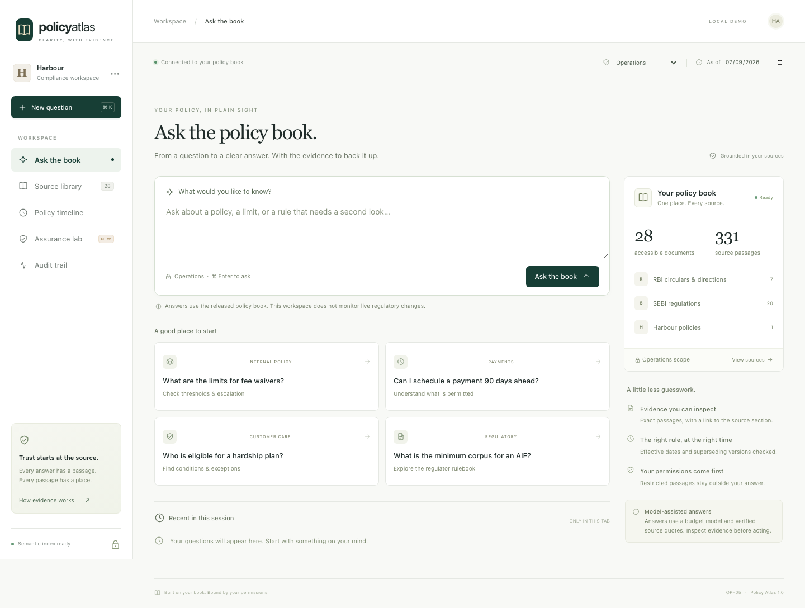

# Policy Atlas

An end-to-end implementation of [OP-05 — Ask the Policy Book](https://github.com/Deployment-inc/Deployment.inc-Hiring-Problems/blob/main/problems/OP-05-ask-the-policy-book.md): a policy desk, exact source citations, requester permissions, historical answers, and a reproducible evaluation pipeline.

**Implemented and tested with a real model, browser E2E journeys, and an isolated Linux container. Qualification is not established.** The no-key preview remains intentionally conservative. See [QA.md](QA.md) for verification, [EVALUATION.md](EVALUATION.md) for scores and failures, and [DEMO.md](DEMO.md) for a five-minute walkthrough.

## What was the assignment?

Build a Q&A application that answers **only from the supplied policy book**, with exact supporting citations—not from the model's general knowledge. The OP-05 contract is a `POST /ask` endpoint accepting a question, requester role, and optional historical date.

The important requirements were:

- Ground every answer in the supplied documents and return exact document/section quotes.
- Respect `public`, `ops`, and `legal` access; distinguish missing evidence from a policy the requester cannot access.
- Apply the right policy version for the requested date and load updated documents correctly after a restart.
- Demonstrate accuracy, citation quality, safe refusals, freshness, latency, and token/cost usage with reproducible tests and the official evaluation tools.

The released book contains **34 documents and 391 passages**. Its role-labeled internal policies are public benchmark fixtures, not private company documents. The repository retains upstream provenance and licenses.

## How I built it

I built a dependency-free Node.js backend and a responsive browser workspace around an evidence-first pipeline:

1. **Validate and index the book.** Check source hashes, section IDs, access labels, effective dates, and supersession relationships before making a snapshot available.
2. **Find the relevant meaning.** Combine keyword ranking with semantic embeddings so a supported question can still work when it is reworded. Keep usable keyword evidence; use bounded semantic recovery when needed.
3. **Select permitted evidence.** Apply role and date restrictions and pack contiguous source excerpts into a bounded context. Restricted excerpts do not enter the answer prompt.
4. **Generate and verify.** A pinned budget model selects evidence IDs. The server reconstructs exact quotes and validates them before releasing an answer; insufficient evidence produces an explicit refusal.
5. **Make the answer inspectable.** Show the original source, evidence links, retrieval trace, model/embedding usage, historical comparison, and an exportable response.
6. **Test the failure paths.** Exercise paraphrases, missing topics, role changes, updates during pending requests, corrupted indexes, provider outages, concurrent requests, and browser journeys.

The implementation was developed with substantial Codex assistance, disclosed below. Design decisions and unsuccessful experiments are retained rather than presenting only the best result.



## Run locally

Requires Node **22.14+** and npm. Python 3 is needed only for the official grader; Docker is optional for the container checks. Serving has **zero runtime npm dependencies**. The pinned corpus is included; after cloning, the offline preview needs no model API or network access.

```bash
git clone https://github.com/ujwalpandey1/deployment_ask_policy_book.git
cd deployment_ask_policy_book
npm ci --ignore-scripts
# Create a local config without overwriting an existing one.
test -f .env || cp .env.example .env
```

For the full semantic Q&A experience, edit **your local `.env` only**:

```dotenv
GENERATION_MODE=model
LLM_API_KEY=replace_with_your_own_key
LLM_BASE_URL=https://api.openai.com/v1
LLM_MODEL=gpt-4.1-mini-2025-04-14
```

Then start the app:

```bash
npm start
# Open http://127.0.0.1:4600
```

No admin, runner, or user-auth tokens are needed for this local demo: the template defaults to `AUTH_MODE=demo` on loopback. `ADMIN_TOKEN` is only needed to enable the protected reload endpoint. For a no-key UI preview, leave the template's `GENERATION_MODE=auto` and `LLM_API_KEY` empty; the preview uses conservative local extraction, not the full model-assisted answer engine.

The interface includes the question desk, original-source inspector, role selector, date comparison, source library, audit view, JSON export, and a synthetic freshness lab. Try “What are the limits and conditions for fee waivers?” as Operations, then switch to Public to see the access refusal. To test a paraphrase, ask “At Harbour, how far into the future can I book a fresh repayment?” as Operations. The interface never persists questions or credentials in browser storage.

`OPENAI_API_KEY` and `OPENAI_BASE_URL` are also supported. Restart after changing configuration. The model must be an exact approved budget snapshot; the two Season 1 pins are in `src/config.js`. Requests use structured outputs, a completion cap, a deadline, and no hidden higher-tier fallback. The provider must return the configured model identity. A provider outage is HTTP 503, **not** “no such policy.” API keys remain server-side.

Model mode now enables **semantic + keyword search** with the same key: paraphrases need not repeat the policy's vocabulary. The first startup embeds the supplied corpus using `text-embedding-3-small` (512 dimensions); subsequent starts reuse a validated disk cache. Each uncached question adds one small embedding request. The provider must support `/embeddings` as well as `/chat/completions`. `SEMANTIC_SEARCH=off` explicitly restores keyword-only retrieval; the no-key preview stays offline. See [PARAPHRASE_FIX.md](PARAPHRASE_FIX.md) for before/after tests, costs and limitations.

## What is different here

| Capability | Engineering mechanism |
|---|---|
| Source-controlled citations | The model selects evidence IDs. The server assembles exact quotes and checks section, document bytes, role and date before release. |
| Permission-aware refusal | A sealed ranker can report that access is needed without passing a restricted passage or document name into the prompt. Source and audit APIs also authorize reads. |
| Historical policy answers | Explicit `supersedes` links form validity intervals; an old version stops governing on its successor’s effective date. A withdrawal never revives an earlier policy. |
| Atomic freshness | Manifest, passage and source hashes define a snapshot. Reload validates everything before swapping; in-flight answers retry if the snapshot changes. |
| Paraphrase-aware retrieval | Semantic vectors + BM25/TF-IDF fusion, with weak-keyword downweighting and protected semantic candidates. Date/role checks remain server-side; balanced contiguous snippets preserve multiple sources. |
| Reusable semantic index | Content-addressed, checksummed vectors tied to the corpus, provider, model and dimensions. Unchanged content is reused on reload; indexing and per-query API usage are metered separately. |
| Bounded repeated work | An LRU keyed by question, role, date, corpus and model; concurrent identical requests share a provider call, with spend attributed once. |
| Inspectable arithmetic | Optional source-bound decimal receipts use integer fractions. Unsupported receipts are withheld with a visible review warning, never marked verified. This is not a general symbolic/date solver. |
| Durable receipts | Serialized, fsynced SHA-256 chained records; a single-writer ownership file prevents two processes from corrupting the log. Questions and answers are hashed, not stored in plaintext. |
| Testable update behavior | Separate fictional policy lab plus a real process-stop/restart rehearsal using `CORPUS_DIR`, `PORT`, `/healthz`, and `/ask`. |
| Honest evaluation | Unmodified official grader, preserved failed experiments, per-slice diagnostics, token ledger, and nulls for unmeasured semantic results. |

## API

```bash
curl http://127.0.0.1:4600/ask \
  -H 'Content-Type: application/json' \
  -d '{"id":"example-1","question":"What are the limits and conditions for fee waivers?","role":"ops","as_of":"2026-09-07"}'
```

`POST /ask` accepts only `{id, question, role, as_of?}` and returns `{id, status, answer, citations, cost_usd, latency_ms}`. Citations contain exactly `{doc_id, section, quote}`. `status` is `answered`, `not_in_corpus` or `not_permitted`. Omitted dates use the UTC calendar date. Bad requests return 400; provider/verification failures return 503 with an error code. No unknown input fields or gold labels are accepted. `/api/ask` adds statement-to-evidence links, verification checks, usage, trace and audit receipt for the UI.

| Route | Purpose |
|---|---|
| `GET /healthz` | Readiness after indexing and audit verification |
| `GET /api/meta` | Mode and visible corpus information |
| `GET /api/documents?role=ops&as_of=2026-09-07&q=…` | Authorized document catalog |
| `GET /api/documents/:id?role=ops` | Original permitted sections; absent and inaccessible IDs both return 404 |
| `POST /api/compare` | `{question, role, before, after}`; rejects mixed corpus snapshots |
| `GET /api/audit?role=ops` | Recent visible receipts and observed local metrics |
| `POST /api/lab` | `{role}`; runs a separate fictional demonstration |
| `POST /api/admin/reload` | Empty JSON object and administrator bearer token; reloads server-configured `CORPUS_DIR` |

## Authentication and deployment

Local `AUTH_MODE=demo` trusts the selected role, as the benchmark runner does. It is restricted to loopback. For a shared deployment, set one of:

```dotenv
# A trusted upstream gateway supplies the authoritative role.
AUTH_MODE=runner
RUNNER_TOKEN=a-random-token-of-at-least-20-characters

# Or bind each credential to its own role.
AUTH_MODE=tokens
AUTH_TOKENS={"a-different-long-random-credential":"ops"}
```

Use `Authorization: Bearer …`. In token mode, caller JSON or URL parameters cannot raise the assigned role. The browser’s lock button opens a credential dialog. Configure TLS at the reverse proxy, separate data directories per process, and a secrets manager in a deployment. The service has request/body/queue limits, same-origin checks and a restrictive CSP; it does not implement organization tenancy or an identity provider.

```bash
# Requires a running Docker daemon; an isolated offline smoke test is provided.
docker compose up --build
```

Supply `RUNNER_TOKEN` through the environment or `.env` first. The container runs as non-root with a read-only filesystem and a data volume. Its build context copies only the serving corpus, not question sets or gold answers. The assignment asks for a private submission repository during the season; repository visibility and formal submission are separate from running this application.

## How to test locally

Start with the no-key checks. Browser tests start and stop their own test server, so they do not require `npm start`:

```bash
npm run verify:data                   # verify all 51 pinned upstream files
npm test                              # backend/security/retrieval/HTTP regressions
npx playwright install chromium       # one-time browser download
npm run test:e2e                       # offline Chromium E2E journeys
npm run rehearse                       # synthetic freshness + real stop/restart
```

For real-model tests, configure `.env` as above. These commands call the provider and **incur API charges**:

```bash
npm run test:paraphrases               # 41 source-derived cases, including 20 paraphrases
npm run test:e2e:live                  # real-model desktop/mobile/paraphrase E2E
npm run evaluate -- --judge            # 146 dev cases + the official semantic grader
```

`npm run benchmark` requires the app to be running in a separate terminal; it sends 146 HTTP requests at concurrency 12. It incurs provider charges when the server is in model mode. `npm run test:container` requires a running Docker daemon and tests an isolated, offline Linux container. On Linux CI, install browser system dependencies with `npx playwright install --with-deps chromium`.

### Recorded results and current limits

| Check | Observed result |
|---|---|
| Backend regression suite | 38 passed |
| Offline / real-model browser E2E | 9 / 3 passed |
| Focused live regression | 41/41 passed; paraphrases improved from 11/20 to 20/20 |
| Cold-answer-cache HTTP load | 146 requests, zero errors, 3.128-second p95 at concurrency 12 |
| Full development evaluation | 98.32% coverage, 86.55% answer accuracy, 100% verbatim citations |
| Freshness / Linux container | Restart rehearsal passed; eight container checks passed |

These are local measurements, not a qualification claim. **Overall answer accuracy is below the 88% target and the earlier 88.24% run; mean input usage is 1,139.29 versus a 1,005-token limit. One blocked question is still answered.** All six development out-of-book questions are refused, but this small sample does not guarantee safe behavior for every question. The earlier unscored held-out artifacts predate the semantic fix. See [EVALUATION.md](EVALUATION.md) for denominators, costs, preserved failures, and remaining review requirements.

GitHub Actions runs corpus verification, backend tests, offline browser tests, freshness rehearsal, offline evaluation, and the container smoke test without API keys. Paid live tests remain opt-in.

### Additional reproduction commands

```bash
bash scripts/reproduce.sh verify        # 51 pinned upstream files, byte-for-byte
bash scripts/reproduce.sh test          # unit, security, concurrency and HTTP tests
npm ci --ignore-scripts                 # only needed for browser tests
npx playwright install chromium
bash scripts/reproduce.sh browser
npm run test:e2e:live                   # explicit paid real-provider desktop/mobile E2E
npm run test:container                  # non-root, read-only, no-network Linux smoke test
bash scripts/reproduce.sh evaluate      # 146 dev cases + unmodified deterministic grader
bash scripts/reproduce.sh baseline     # TF-IDF comparison with the same guardrails
node scripts/calibrate.js               # development-only refusal/coverage curve
bash scripts/reproduce.sh freshness     # actual service stop/restart, synthetic rules
bash scripts/reproduce.sh benchmark     # service must already be running; concurrency 12
bash scripts/reproduce.sh heldout       # unlabelled predictions only, no score claimed
```

Use `MIN_EXTRACTIVE_COVERAGE=0.23` with the baseline/evaluate commands to reproduce the permissive extraction operating point. The default 0.55 is a deliberately strict preview. These are lexical match thresholds, not calibrated confidence probabilities. Earlier experiments are retained with their original outputs; minor implementation changes are recorded in [EXPERIMENT_LOG.md](EXPERIMENT_LOG.md).

For semantic grading, set `LLM_API_KEY`, `LLM_BASE_URL`, `JUDGE_MODEL=gpt-4.1-mini-2025-04-14`, then run `bash scripts/reproduce.sh evaluate --judge`. This invokes the **upstream** grader. The upstream grader does not expose its judge token usage: capture it at a metered gateway before reporting complete evaluation spend. Candidate generation usage, including incomplete/malformed provider replies, is separately recorded. A missing provider usage value remains `null`.

`--url http://127.0.0.1:4600` evaluates through the HTTP interface. The default evaluator runs the same engine directly with caching disabled and labels that timing accordingly. Gold fields and tags remain evaluator-side; only the four public fields reach inference. `answers_dev.jsonl` is the latest run; immutable run-named originals live in `results/raw/`.

Browser reports are generated locally in `results/browser-report/index.html` and `results/live-browser-report/index.html`; these generated reports and traces are ignored by Git. Selected screenshots and benchmark artifacts are retained in the repository. Live tests use a separate temporary server and audit directory, not your running workspace. They record real answers and provider-returned usage; no API key enters a browser trace. Tests have no automatic retries that hide a failed run.

## Secrets and safe configuration

- Commit only `.env.example`, which contains empty credential fields. Put actual credentials in your local `.env` or a deployment secret manager.
- `.gitignore` excludes `.env`, local environment variants, credential/key files, runtime audit/index data, dependencies, and generated browser reports. `.dockerignore` also excludes local credentials from the build context.
- API keys stay on the backend. Do not paste them into frontend code, screenshots, issue reports, or committed test fixtures.
- `AUTH_MODE=demo` is for loopback-only local testing. Shared deployments need authenticated roles, TLS, and properly generated secrets.
- Indexing sends source text to the configured embedding provider. Approve that provider before using your own sensitive documents; the shipped corpus is a public benchmark.

## Corpus updates

```bash
CORPUS_DIR=/absolute/path/to/revised-corpus PORT=4600 \
  bash scripts/reproduce.sh serve
```

The directory must contain `manifest.jsonl`, `passages.jsonl`, and referenced text files in the published format. Canonical source sections have `[doc_id#section]` markers. SHA mismatches, duplicates, unknown roles, unsafe paths, contradictory dates and supersession cycles prevent loading. The corpus is read again on every restart. For live reload, configure `ADMIN_TOKEN`, replace the corpus completely, then send an authenticated empty-object POST to `/api/admin/reload`. A failed reload leaves the previous complete snapshot active; the caller receives an error and must investigate. There is no live RBI/SEBI crawler or freshness claim about actual regulations.

For an audit crash, preserve `audit.jsonl` and the ownership file. Verify that the owning process is stopped before manually removing its `audit.lock`; then restart and let hash verification run. Anchor receipts externally to detect replacement of an entire log. See [RUNBOOK.md](RUNBOOK.md).

## Project map

```text
src/          corpus validation, retrieval, generation, proof checks, cache, audit, HTTP
web/          dependency-free, responsive browser application
scripts/      reproduce, pinned importer, evaluation, calibration, load and freshness checks
tests/        backend tests and Playwright user journeys
vendor/op05/  exact published corpus, schemas, questions and official grader
results/      actual measurements, raw cases, ledgers, and screenshots
```

Design and tradeoffs: [ARCHITECTURE.md](ARCHITECTURE.md), [DECISIONS.md](DECISIONS.md), [LANDSCAPE.md](LANDSCAPE.md). Operational/compliance handoff: [MEMO.md](MEMO.md), [RUNBOOK.md](RUNBOOK.md). Results and failure taxonomy: [EVALUATION.md](EVALUATION.md), [EXPERIMENT_LOG.md](EXPERIMENT_LOG.md).

## Attribution and assistance

Corpus and tasks: Deployment.inc, derived from [Rajveer-code/IndiaFinBench](https://huggingface.co/datasets/Rajveer-code/IndiaFinBench), CC BY 4.0. Upstream reference code is MIT. Exact origin, commit and checksums are recorded in `vendor/provenance.json`, `vendor/upstream/RELEASE_MANIFEST.json`, and [THIRD_PARTY_NOTICES.md](THIRD_PARTY_NOTICES.md). Model integration follows [official Structured Outputs documentation](https://developers.openai.com/api/docs/guides/structured-outputs) and the challenge’s pinned models.

This implementation and its documentation were substantially produced with Codex assistance. Automated checks, visual inspection, real-model requests and the published semantic grader were run locally. No independent human validation, hidden-set score, private freshness score or hiring qualification is claimed.
